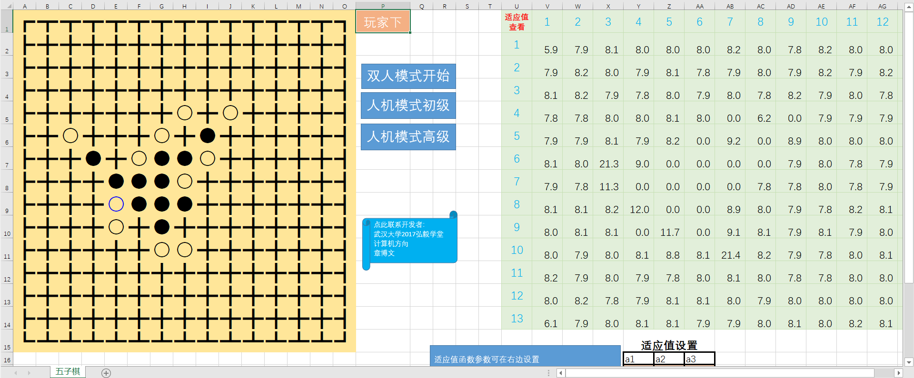

# "five in a row" in EXCEL VBA

This is a project in terms of arificial intelligent algorithm. 

+ Both player vs player & player vs computer are available
+ For p vs c, the game tree algorithm is used, which is a basic idea in game theory.

A screen shot of this program:

</img>

---
具体中文实现见readme.doc